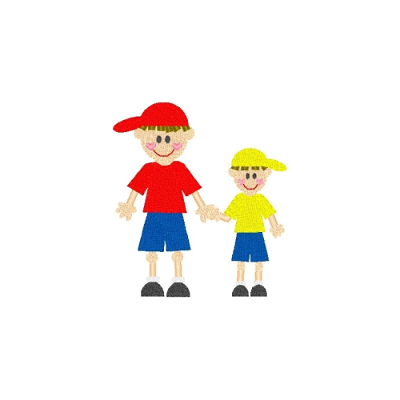

 

### Here are 10 fun facts about me!

 

<ul>
  <li>My favorite food is Maggi. Here is an <a href="https://www.amazon.com/Maggi-Minutes-Noodles-Masala-grams/dp/B07B4KQRZG/ref=sr_1_2?sr=8-2" target="_blank">Amazon link</a> if you would like to buy some for me :)</li>
  <li>My favorite color is red.</li>
  <li>My favorite animals are monkeys!</li>
  <li>I have a little brother who is almost 7 years old.</li>
  <li>I play the piano, level 8.</li>
  <li>I am a black belt in karate, and I teach at my dojo.</li>
  <li>I am a member of Team Optix 3749!</li>
  <li>I am a member of CyberAegis.</li>
  <li>Apart from AP CSP this year, I am also taking HPoE, World History, AP Calc AB, AP Chem, and AP English Seminar.</li>
  <li>My favorite artists are Abel, Metro, and Future. This is one of my favorite songs:</li>
  <iframe style="border-radius:12px" src="https://open.spotify.com/embed/track/6qjlcNvLc0kEO2LVvkYx0u?utm_source=generator" width="50%" frameBorder="0" allowfullscreen="" allow="autoplay; clipboard-write; encrypted-media; fullscreen; picture-in-picture" loading="lazy"></iframe>
</ul>

  <!-- Full-width images with number and caption text -->
  

    
1 / 10

    
  

  

    
2 / 10

    
  

  

    
3 / 10

    
  

  

    
4 / 10

    
  

  

    
5 / 10

    
  

  

    
6 / 10

    
  

  

    
7 / 10

    
  

  

    
8 / 10

    
  

  

    
9 / 10

    
  

  

    
10 / 10

    
  

   
  <!-- Next and previous buttons -->
  <a class="prev" onclick="plusSlides(-1)">&#10094;</a>
  <a class="next" onclick="plusSlides(1)">&#10095;</a>

 

<!-- The dots/circles -->

  
  
  
  
  
  
  
  
  
  

