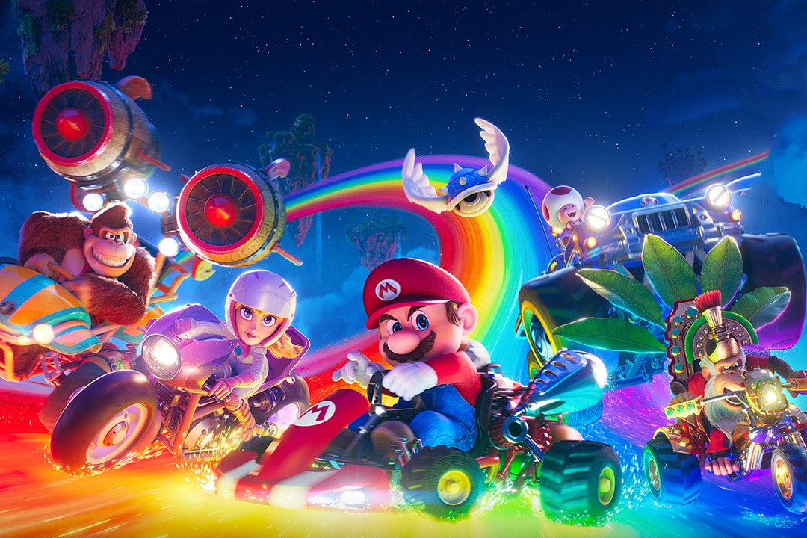
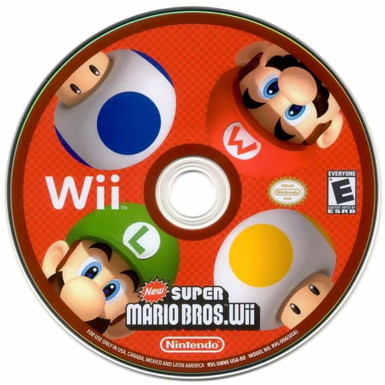

 

Mario is a video game character created by Nintendo. He is an iconic mascot of the company and one of the most recognizable characters in gaming history! Mario is often portrayed as an Italian plumber who lives in the Mushroom Kingdom, a fantasy world filled with colorful characters and creatures, such as Toads, Goombas, and Koopas.

The main goal in most Mario games is to rescue Princess Peach, who’s frequently kidnapped by Bowser (L bozo), a giant turtle-dinosaur-dog hybrid thing. Mario has to travel through different levels, overcoming obstacles, jumping on enemies, and collecting items like coins and power-ups (such as mushrooms that make him grow or give him special abilities) to reach his goal.

The games are famous for their fun gameplay, creative worlds, and the challenge of timing jumps and movements just right. Mario has appeared in many different kinds of games, from platformers (like "Super Mario Bros.") to racing games (like "Mario Kart") and sports games (like "Mario Tennis").

I am a huge fan of Super Mario. My favorite game is the 2009 New Super Mario Bros. Wii. In my free time, I like to play the game with my younger brother. I have completed the entire game several times!

    

        
1. Which of these is a valid variable name?

        <input type="radio" name="q1" value="A">george! 
        <input type="radio" name="q1" value="B">P3PPA 
        <input type="radio" name="q1" value="C">1_2_3 
         
        <button onclick="checkAnswer(1, 'B')">Submit Answer</button>
    

    

        
2. What naming convention is this variable name: xbox_controller

        <input type="radio" name="q2" value="A">Snake Case 
        <input type="radio" name="q2" value="B">Pascal Case 
        <input type="radio" name="q2" value="C">Camel Case 
         
        <button onclick="checkAnswer(2, 'A')">Submit Answer</button>
    

    

        
3. Which of these is a boolean?

        <input type="radio" name="q3" value="A">"true" 
        <input type="radio" name="q3" value="B">False 
        <input type="radio" name="q3" value="C">false 
         
        <button onclick="checkAnswer(3, 'C')">Submit Answer</button>
    

