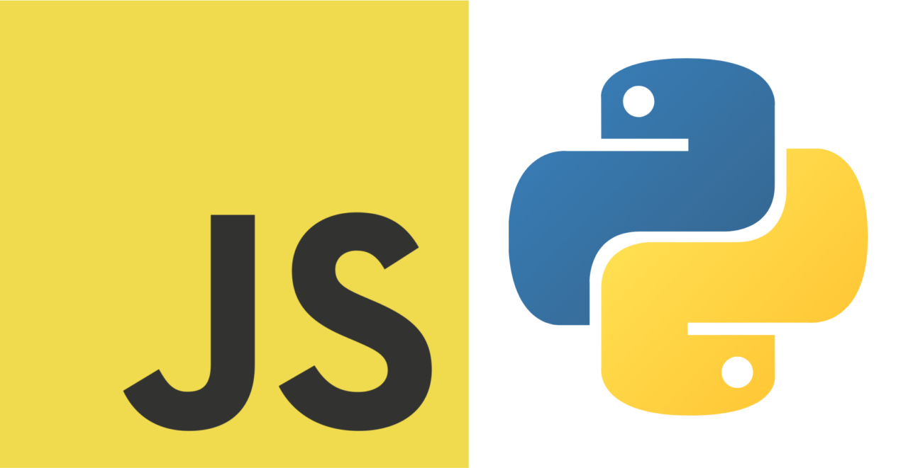

 

These are the homework files that I have submitted for the other table groups in my class.

Our table covered 3.1 and 3.4, so the links lead to our website.

<button class="unit"><a href="https://nighthawkcoders.github.io/portfolio_2025/csp/big-idea/3.1/p5/objectives">3.1</a></button>
<button class="unit"><a href="units/3/2">3.2</a></button>
<button class="unit"><a href="units/3/3">3.3</a></button>
<button class="unit"><a href="https://nighthawkcoders.github.io/portfolio_2025/csp/big-idea/3.4/py/strings">3.4</a></button>
<button class="unit"><a href="units/3/5">3.5</a></button>
<button class="unit"><a href="units/3/6">3.6</a></button>
<button class="unit"><a href="units/3/7">3.7</a></button>
 
 
<button class="issue"><a href="https://github.com/aadibhat09/aadi_2025/issues/7" target="_blank">My issue</a></button>
 
 

