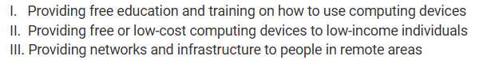

<br>

Today, I took the 2018 practice multiple-choice exam on Collegeboard and I received a score of 59/66.

Here's what I got wrong and an explanation of the correct answer:

<br>
<hr>

## Question 1

<br>

### The code segment below is intended to swap the values of the variables `first` and `second` using a temporary variable, `temp`. Which of the following can be used to replace `<MISSINC CODE>` so that the code segment works as intended?

<br>


Answer: C
```
second <-- temp
```

<br>

I chose answer D, which is `temp <-- second`. However, this is incorrect as it sets the value of the variable `temp` to the value of the variable `second`.

<br>
<hr>

## Question 17

<br>

### Which of the following actions could be used to help reduce the digital divide?

<br>



Answer: D
```
I, II, and III
```

<br>

I chose answer C, which is `II and III only`. However, this is incorrect as providing networks and infrastructure to people in remote areas is also an example of an action that could help reduce the digital divide.

<br>
<hr>

## Question 47

<br>

### In public key cryptography, the sender uses the recipient’s public key to encrypt a message. Which of the following is needed to decrypt the message?

<br>

Answer: D
```
The recipient’s private key
```

<br>

I chose answer C, which is `the recipient's public key`. However, this is incorrect as private keys are used for decryption, not encryption, so the recipient's private key would be required to decrypt the message.

<br>
<hr>

## Question 51

<br>

### Which of the following is an example of symmetric encryption?

<br>

Answer: B 
```
Finn and Gwen develop a system that maps each letter of the alphabet to a unique symbol using a secret key. Finn uses the key to write a message to Gwen where each letter is replaced with the corresponding symbol. Gwen uses the key to map each symbol back to the original letter.
```

<br>

I chose answer A, which is:
```
Evy buys a locked box that operates using two different codes. When the first code is entered, a slot opens that allows a message to be put in the box. When the second code is entered, the door to the box opens. Evy gives the first code to her friends so they can leave messages for her and keeps the second code to herself so that she is the only one who can retrieve the messages.
```
However, this is incorrect as each code is not mapped to a corresponding message the way it is supposed to be in symmetric encryption.

<br>
<hr>

## Question 56

<br>

### Consider the following program. Which of the following describes the result of executing the program?

<br>


<br>

Answer: D
```
The program displays the sum of the odd integers from 1 to 19.
```

<br>

I chose answer B, which is `The program displays the sum of the even integers from 0 to 20.` However, this is incorrect as the variable `count` starts at 1, which is an odd number, so the program will display the sum of the odd numbers from 1 to 19.

<br>
<hr>

## Question 59

<br>

### A media librarian at a movie studio is planning to save digital video files for archival purposes. The movie studio would like to be able to access full-quality videos if they are needed for future projects. Which of the following actions is LEAST likely to support the studio’s goal?

<br>

Answer: B
```
Using lossy compression software to reduce the size requirements of the data being stored
```

<br>

I chose answer D, which is `Using a system that incorporates redundancy to handle disk failure`. However, this is incorrect as handling disk failure can help support the studio's goal.

<br>
<hr>

## Question 62

<br>

### A free online encyclopedia contains articles that can be written and edited by any user. Which of the following are advantages the online encyclopedia has over a traditional paper-based encyclopedia? Select two answers.

<br>

Answers: C & D
```
The ability to have a larger number of perspectives reflected in the encyclopedia content
The ability to quickly update encyclopedia content as new information becomes available
```

<br>

I chose answers A and D. Answer A is `The ability to easily check that the encyclopedia is free of copyrighted content`. However, this is incorrect as the online encyclopedia can be edited by any user and thus cannot be easily checked for copyrighted content.

<br>
<hr>

## Wrapping up

Before I took this MCQ, I did not know about topics such as citizen science, public and private keys, and much more. I was able to answer most of these questions, especially ones asking what the program does or what to change to make it work, as I have past knowledge in programming. This MCQ shows me that I need to work on non-programming-related topics that are still in the scope of this class.
