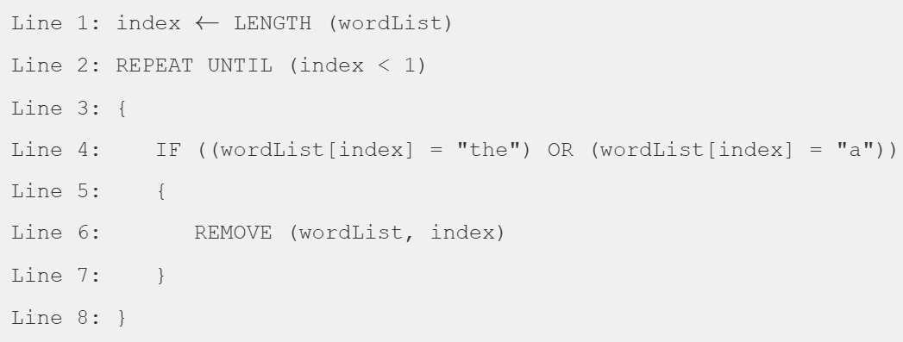
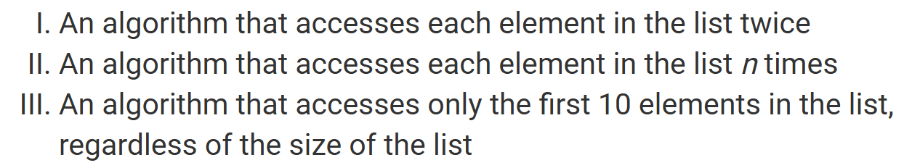
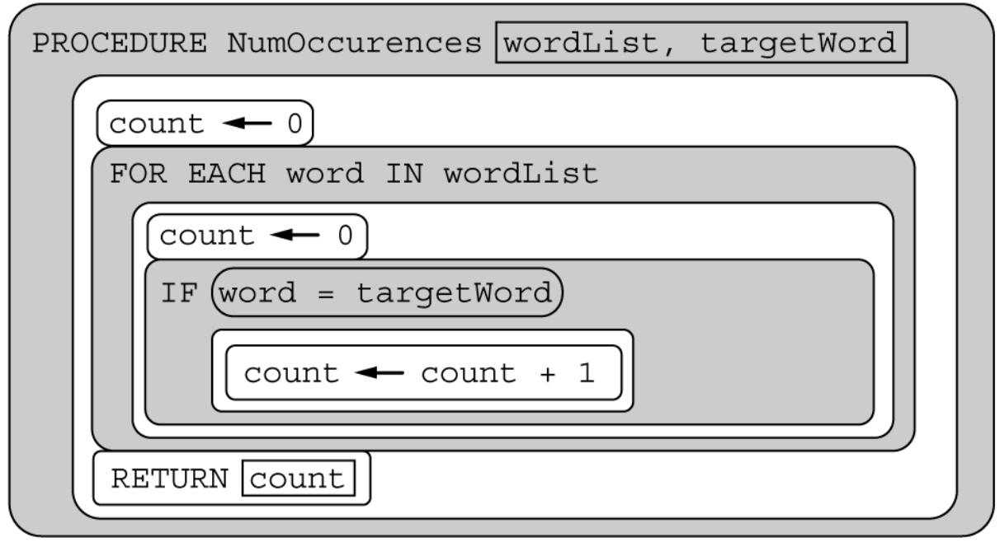
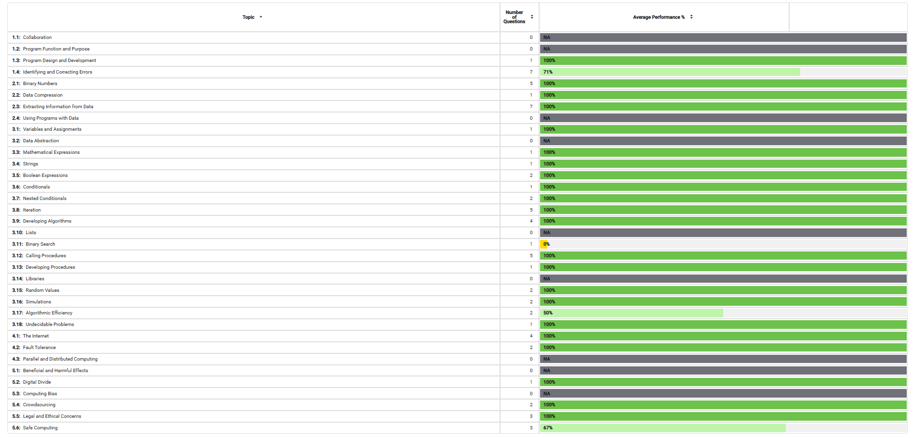

<br>

Today, I took the 2025 practice multiple-choice exam on Collegeboard and I received a score of 62/67.

Here's what I got wrong and an explanation of the correct answer:

<br>
<hr>

## Question 16

<br>

### A student wrote the following program to remove all occurrences of the strings `"the"` and `"a"` from the list `wordList`. While debugging the program, the student realizes that the loop never terminates. Which of the following changes can be made so that the program works as intended?

<br>



Answer: D
```
Inserting `index ← index - 1` between lines 7 and 8
```

<br>

I chose answer B, which is `Inserting index ← index + 1 between lines 7 and 8`. However, this is incorrect because the index starts at the end of the wordlist, not the start, so it must decrease in value after each iteration to go down the wordlist.

<br>
<hr>

## Question 40

<br>

### Which of the following best explains how a certificate authority is used in protecting data?

<br>

Answer: D
```
A certificate authority verifies the authenticity of encryption keys used in secured communications.
```

<br>

I chose answer B, which is `A certificate authority issues passwords that grant access to secure databases`. However, this is incorrect because a certificate authority is used to validate the authenticity of encryption keys, not to issue passwords.

<br>
<hr>

## Question 47

<br>

### The procedure `BinarySearch (numList, target)` correctly implements a binary search algorithm on the list of numbers `numList`. The procedure returns an index where `target` occurs in `numList`, or `-1` if `target` does not occur in `numList`. Which of the following conditions must be met in order for the procedure to work as intended?

<br>

Answer: C
```
The values in numList must be in sorted order.
```

<br>

I chose answer B, which is `The list numList must not contain any duplicate values`. However, this is incorrect because a binary search does not depend on whether the list contains duplicate values, but the list must be sorted for `target` to be able to be located in `numList`.

<br>
<hr>

## Question 50

<br>

### Consider the following algorithms. Each algorithm operates on a list containing *n* elements, where *n* is a very large integer. Which of the algorithms run in reasonable time?

<br>



Answer: D
```
I, II, and III
```

<br>

I chose answer A, which is `I only`. The first choice is correct because the elements are accessed in 2*n* time, however, the second choice is also correct because the elements are accessed in *n*^2 time, and the third choice is also correct because the elements are accessed in *n* time.

<br>
<hr>

## Question 67

<br>

### The procedure `NumOccurrences` is intended to count and return the number of times `targetWord` appears in the list `wordList`. The procedure does not work as intended. For which of the following code segments will the call to `NumOccurrences` NOT return the intended value? Select two answers.

<br>



Answer: A & B
```
treeList <-- ["birch", "maple", "birch"]
numOccurrences(treeList, "birch")

treeList <-- ["birch", "maple", "oak"]
numOccurrences(treeList, "maple")
```

<br>

I chose answers B and D. Answer D has an array of `["birch", "maple", "oak"]` and calls `numOccurrences(treeList, "spruce")`.  This still returns the intended value because `"spruce"` does not appear in `treeList` at all, thus `count` will never change and will be displayed at `0`.

<br>
<hr>

## Wrapping up

I need to familiarize myself with topics such as time complexity, like in question 50, and certificate authority, like in question 40. I also missed a few questions because I did not spend enough time thouroughly reading each answer choice, which is why I missed 16, as I had thought that the index value was increasing and not decreasing. Overall, this MCQ shows that I should slow down on each question and familiarize myself with non-programming topics.

<br>


