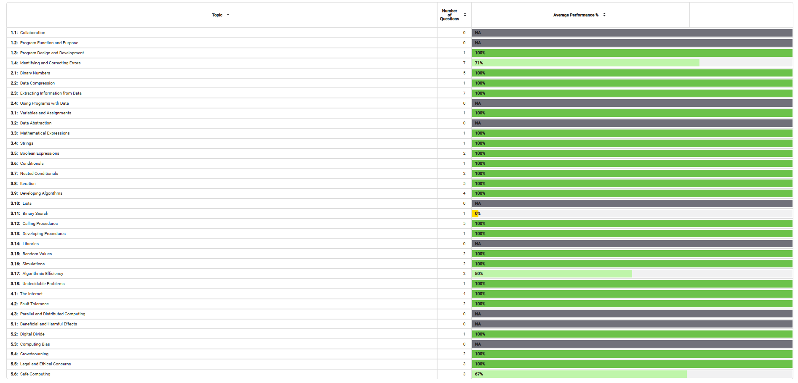

<br>

Today, I took the 2021 practice multiple-choice exam on Collegeboard and I received a score of 67/70.


Here's what I got wrong and an explanation of the correct answer:

<br>
<hr>

## Question 19 (Skill 5.E)

<br>

### Which of the following best explains how devices and information can be susceptible to unauthorized access if weak passwords are used?

<br>

```
A) Unauthorized individuals can deny service to a computing system by overwhelming the system with login attempts.
B) Unauthorized individuals can exploit vulnerabilities in compression algorithms to determine a user’s password from their decompressed data.
C) Unauthorized individuals can exploit vulnerabilities in encryption algorithms to determine a user’s password from their encryption key.
D) Unauthorized individuals can use data mining and other techniques to guess a user’s password.
```

Answer: D

<br>

I chose answer C. This is incorrect because the exploitation of encryption algorithms is not related to password strength. I misunderstood and chose this answer because I thought it meant that the hacker could easily brute force the encrypted string to retrieve the password if the password is short. Answer D is correct because weak passwords can be guessed easily based on publicly available information.

<br>
<hr>

## Question 33 (Skill 1.D)

<br>

### A company delivers packages by truck and would like to minimize the length of the route that each driver must travel in order to reach *n* delivery locations. The company is considering two different algorithms for determining delivery routes. Which of the following best categorizes algorithm II?

```
Algorithm I: Generate all possible routes, compute their lengths, and then select the shortest possible route. This algorithm does not run in reasonable time.

Algorithm II: Starting from an arbitrary delivery location, find the nearest unvisited delivery location. Continue creating the route by selecting the nearest unvisited location until all locations have been visited. This algorithm does not guarantee the shortest possible route and runs in time proportional to n^2.
```

<br>

```

A) Algorithm II attempts to use an algorithmic approach to solve an otherwise undecidable problem.
B) Algorithm II uses a heuristic approach to provide an approximate solution in reasonable time.
C) Algorithm II provides no improvement over algorithm I because neither algorithm runs in reasonable time.
D) Algorithm II requires a much faster computer in order to provide any improvement over algorithm I.
```

Answer: B

<br>

I chose Answer C. This is incorrect because Algorithm II runs in time proportional to n^2, which is considered reasonable time because n^2 is a polynomial. Algorithm I does not run in reasonable time. I thought that n^2 was unreasonable time, which is why I got this question wrong.

<br>
<hr>

## Question 50 (Skill 5.E)

<br>

### Which of the following best explains how symmetric encryption algorithms are typically used?

```
A) Symmetric encryption uses a single key that should be kept secret. The same key is used for both encryption and decryption of data.
B) Symmetric encryption uses a single key that should be made public. The same key is used for both encryption and decryption of data.
C) Symmetric encryption uses two keys that should both be kept secret. One key is used for encryption, and the other is used for decryption.
D) Symmetric encryption uses two keys. The key used for encryption should be made public, but the key used for decryption should be kept secret.
```

Answer: A

<br>

I chose answer C which is incorrect because symmetric encryption uses a single key. Answer A is correct because the key is used to unlock data and must be kept secret. I thought symmetric encryption used two private keys, which is why I got this question wrong.

<br>
<hr>

## Wrapping Up

I mainly struggled on networking and security topics on this MC. This MC shows that I need to review networking topics such as encryption and the use of private and public keys, password strengths, and driving-route algorithms.

In this MC I did not encounter these skills, but I can practice with other MCQs to understand these topics:
- 1.3: Program Design and Development
- 3.2: Data Abstraction
- 3.13: Developing Procedures
- 3.14: Libraries

<br>

### 2021 vs 2020



