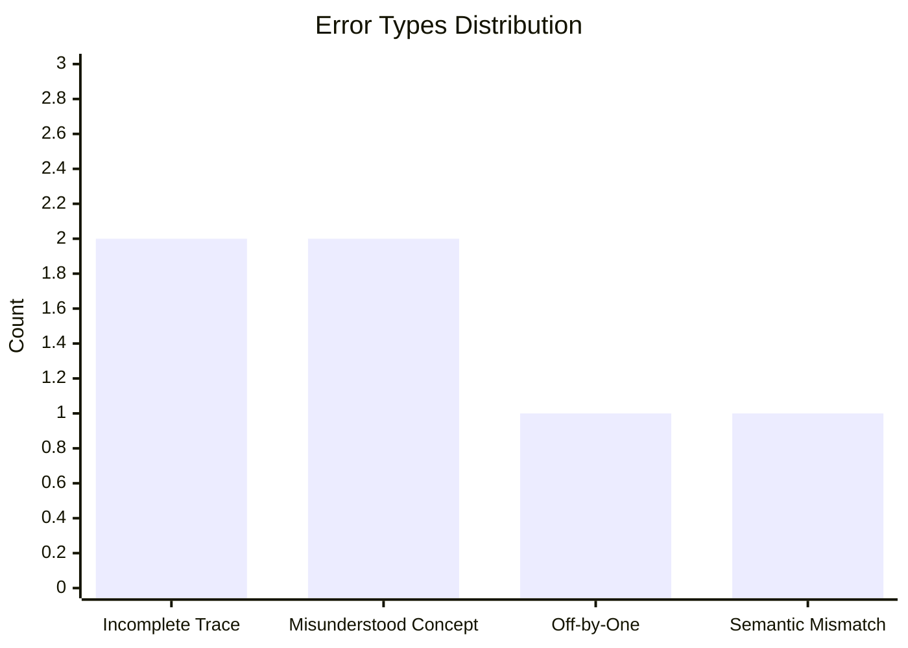

**Exam Performance Summary**  
**Total Incorrect:** 6 questions  
**Focus Areas:** String manipulation, OOP constructors, loop analysis, sorting algorithms  


---

## I. Overview

This reflection examines six incorrectly answered questions from an AP Computer Science A practice exam. The errors span multiple units and reveal specific conceptual gaps requiring targeted remediation.

The mistakes cluster around **procedural tracing** (loops and string operations), **static variable behavior**, and **algorithm visualization** (insertion sort). While these topics appear straightforward, they require careful step-by-step execution tracking—a skill that demands deliberate practice.

---
---

## II. Question-Level Breakdown

| **Question** | **Topic**                          | **AP Unit / Subtopic**        | **My Error Type**         |
| ------------ | ---------------------------------- | ----------------------------- | ------------------------- |
| Q15           | String substring traversal         | 2.6 – Strings                 | Incomplete trace          |
| Q17           | System reliability best practices  | 3.1 – Software Development    | Misinterpreted visibility |
| Q25           | Static variable increment tracking | 3.3 – Static Variables        | Overlooked constructor    |
| Q28           | Adjacent character comparison      | 2.6 – Strings                 | Miscounted occurrences    |
| Q40           | Insertion sort after 3 passes      | 5.5 – Sorting Algorithms      | Off-by-one iteration      |
| Q42           | While-to-for loop translation      | 2.8 – for Loops               | Semantic mismatch         |

---

## III. Deep Analysis, Approach, and Corrections

### **Q15 – String Substring Traversal**

**Topic:** String methods and loop execution  
**Code:**
```java
String str = "lookout";
String target = "o";
int j = str.indexOf(target);
while (j >= 0) { 
   str = str.substring(j);
   System.out.print(str + " ");
   str = str.substring(1);
   j = str.indexOf(target);
}
```

**My Approach:**  
I assumed the loop would only find the first occurrence of "o" and then exit, thinking `substring(1)` would skip past all "o" characters. I selected **"ookout out"**, missing the second "o" in the original string.

**Correct Approach:**  
The loop finds **every** occurrence of "o" by continuously shortening `str`:

1. `j = 1` → `str = "ookout"` → prints `"ookout "`
2. `str = "okout"` (after `substring(1)`)
3. `j = 0` → `str = "okout"` → prints `"okout "`
4. `str = "kout"` (after `substring(1)`)
5. `j = 1` → `str = "out"` → prints `"out "`
6. `str = "ut"` (after `substring(1)`)
7. `j = -1` → loop terminates

**Correct Output:** `"ookout okout out"`

**Correction:**  
When a loop modifies the string it's searching, trace **every iteration** explicitly. Each `substring(1)` call advances by exactly one character, allowing the loop to find subsequent matches.

---

### **Q17 – System Reliability Best Practices**

**Topic:** Software development principles  
**Question:** Which action maximizes system reliability?

**My Approach:**  
I selected **"Using public visibility for behaviors"** because I thought making methods accessible would allow better integration testing. I confused accessibility with reliability.

**Correct Approach:**  
**Testing under a wide variety of conditions** is the primary method to ensure system reliability. This includes:
- Edge cases (empty inputs, maximum values)
- Different device types and operating systems
- Various network conditions
- International locales and time zones

Making behaviors `public` affects **encapsulation** and **API design**, not reliability. In fact, unnecessary public access can *reduce* reliability by exposing internal implementation details.

**Correction:**  
Reliability stems from **comprehensive testing**, not visibility modifiers. Remember: accessibility ≠ dependability.

---

### **Q25 – Static Variable Tracking**

**Topic:** Static vs. instance variables  
**Code:**
```java
public class Shoe {
   private static int count = 0;
   
   public Shoe() {
      size = 7.0;
      style = "boot";
   }
  
   public Shoe(double mySize, String myStyle) {
      size = mySize;
      style = myStyle;
      count++;
   }
}

Shoe s1 = new Shoe(8.5, "sneaker");
Shoe s2 = new Shoe();
Shoe s3 = new Shoe(7.0, "sandal");
System.out.println(Shoe.getCount());
```

**My Approach:**  
I assumed both constructors would increment `count`, expecting the output to be **3**. I thought the default constructor would automatically call the increment logic.

**Correct Approach:**  
Only the **two-parameter constructor** increments `count`. The no-parameter constructor has no `count++` statement:
- `s1` → `count = 1` (two-parameter constructor)
- `s2` → `count = 1` (no-parameter constructor, no increment)
- `s3` → `count = 2` (two-parameter constructor)

**Output:** `2`

**Correction:**  
Static variables track class-level state, but each constructor defines its own behavior independently. Never assume one constructor inherits another's side effects unless explicitly chained with `this()`.

---

### **Q8 – Adjacent Character Comparison**

**Topic:** String traversal and comparison  
**Code:**
```java
String str = "abbcdddeff";
int j = 0; 
int count = 0;
while (j < str.length() - 1) { 
   if (str.substring(j, j + 1).equals(str.substring(j + 1, j + 2))) {
      count++;
   }
   j++;
}
System.out.println(count);
```

**My Approach:**  
I selected **2**, counting only the obvious pairs "bb" and "ff". I overlooked that "ddd" contains **two** adjacent equal pairs, not one.

**Correct Approach:**  
The code checks **each adjacent pair** in the string:
- Position 1-2: `"b" == "b"` → count = 1
- Position 4-5: `"d" == "d"` → count = 2
- Position 5-6: `"d" == "d"` → count = 3
- Position 8-9: `"f" == "f"` → count = 4

For "ddd", there are **two** comparisons (positions 4-5 and 5-6).

**Output:** `4`

**Correction:**  
When counting adjacent matches, remember that a sequence of n identical characters contains **(n-1)** adjacent pairs. Visualize the sliding window moving one position at a time.

---

### **Q40 – Insertion Sort After 3 Passes**

**Topic:** Algorithm visualization  
**Initial Array:** `[60, 30, 10, 20, 50, 40]`

**My Approach:**  
I selected **`[10, 30, 60, 20, 50, 40]`**, which represents the state after **two** passes. I lost track of which pass I was on.

**Correct Approach:**  
Insertion sort builds a sorted prefix incrementally:

**Pass 1** (j=1): Insert 30  
`[30, 60, 10, 20, 50, 40]`

**Pass 2** (j=2): Insert 10  
`[10, 30, 60, 20, 50, 40]`

**Pass 3** (j=3): Insert 20  
`[10, 20, 30, 60, 50, 40]`

**Correct Answer:** `[10, 20, 30, 60, 50, 40]`

**Correction:**  
Always write out **each intermediate state** when tracing sorting algorithms. Label each pass explicitly to avoid off-by-one errors.

---

### **Q42 – While-to-For Loop Translation**

**Topic:** Loop equivalence  
**Original Code:**
```java
int j = 0;
int sum = 0;
while (j <= 5) {
   j++;
   sum += j;
}
```

**My Approach:**  
I selected **`for (int j = 1; j <= 5; j++)`**, thinking the loop added numbers 1 through 5. I didn't account for the fact that `j` increments **before** being added to sum.

**Correct Approach:**  
The while loop adds **1, 2, 3, 4, 5, 6** to sum:
- Iteration 1: j=0 → j becomes 1 → sum += 1
- Iteration 2: j=1 → j becomes 2 → sum += 2
- ...
- Iteration 6: j=5 → j becomes 6 → sum += 6

The equivalent for loop is:
```java
int sum = 0;
for (int j = 1; j <= 6; j++) {
   sum += j;
}
```

**Correct Answer:** D

**Correction:**  
When converting loops, identify **when** and **where** the variable updates occur. Pre-increment vs. post-increment placement drastically changes the loop's behavior.

---

## IV. Error Pattern Analysis


**Key Observation:**  
Four of six errors involve **execution tracing** (questions 1, 4, 5, 6). This indicates that mental simulation of code execution is the primary weakness, not conceptual understanding.

---

## V. Synthesis

### Strengths
- Understanding of OOP principles (constructors, static variables)
- Recognition of software engineering best practices
- Familiarity with standard algorithms (insertion sort structure)

### Weaknesses
- **Incomplete mental traces** of iterative processes
- Tendency to stop tracing too early (off-by-one errors)
- Difficulty tracking state changes across multiple loop iterations

### Root Cause
The common thread is **execution tracking discipline**—moving too quickly through iterations without explicitly writing intermediate states.

---

## VI. Conclusion

This exam revealed a **procedural discipline gap** rather than a conceptual understanding gap. I understand the mechanics of loops, strings, and OOP, but I rush through execution traces, leading to preventable errors.

Moving forward, I will adopt a **structured tracing methodology** for all iteration and string manipulation problems:

1. **Create a trace table** with columns for loop variable, condition status, and any modified data structures
2. **Write out the first 3 iterations explicitly** before attempting to identify patterns
3. **Mark the exact line where changes occur** (especially for pre vs. post-increment scenarios)
4. **Double-check edge cases** such as the final iteration and adjacent comparison boundaries

For example, on Q28 (adjacent character comparison), a simple trace table would have immediately revealed:
```
j | char at j | char at j+1 | match?
0 | 'l'      | 'o'        | no
1 | 'o'      | 'o'        | YES (count=1)
...
```

This systematic approach transforms tracing from a mental exercise into a verifiable process, eliminating the rushed assumptions that caused 67% of my errors. Rather than relying on intuition, I will build evidence-based confidence through explicit documentation of program state.
