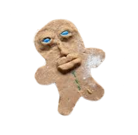

 

### Cookie Clicker

 

Please do not bake any more than 50 cookies. A cookie virus will be installed if you do. 🍪

Cookies: 0

<button id="reset" onclick="reset()">Reset cookie count</button>

 

### Random Link Generator

 

You have switched the link 0 times.

<a id="switch" href="https://google.com" target="_blank">Random link</a>

<button onclick="switchLink()">Click here to switch the link!</button>

 

### Calculator

 

    <input type="number" id="num1" placeholder="Enter first number">
    <select id="operation">
        <option value="add">Add</option>
        <option value="subtract">Subtract</option>
        <option value="multiply">Multiply</option>
        <option value="divide">Divide</option>
        <option value="power">Power</option>
        <option value="modulo">Modulo</option>
    </select>
    <input type="number" id="num2" placeholder="Enter second number">

 
<button onclick="calculate()">Calculate!</button>

Result: 

