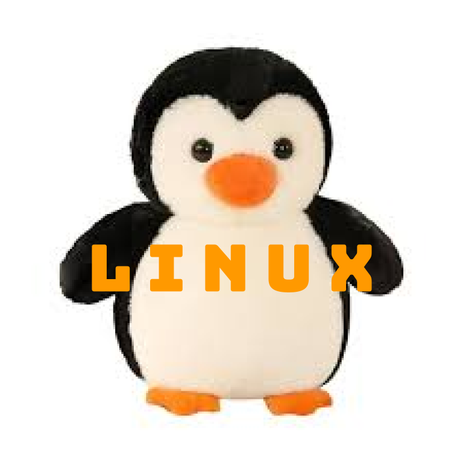

 

So far in my journey in AP Computer Science Principles, I:

- Installed WSL through PowerShell
- Made a `nighthawk` folder in my home directory
- Cloned the portfolio repository in my `nighthawk` folder
- Ran the `activate_ubuntu.sh` script in the repository to install all necessary packages
- Made my own repository and cloned it into my `nighthawk` folder
- Changed the `index.md` markdown file and made my first commit

